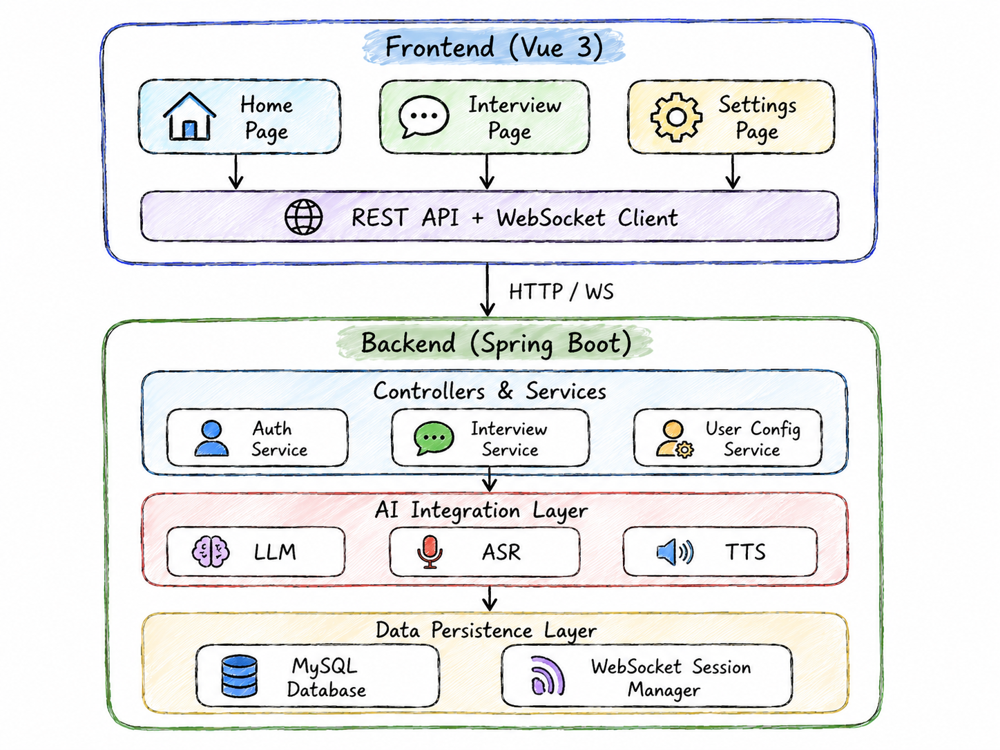

# Interview Coach AI

<div align="center">


**AI 驱动的智能面试教练系统 | AI-Powered Intelligent Interview Coaching System**

[功能特性](#-功能特性) • [快速开始](#-快速开始) • [技术架构](#-技术架构) • [API文档](#-api文档) • [贡献指南](#-贡献指南)

</div>

---

## 📖 项目简介

Interview Coach AI 是一个基于人工智能的全栈面试训练平台，通过模拟真实面试场景，帮助用户提升面试技巧和表达能力。系统支持多种面试类型（技术面试、HR面试、压力面试），提供实时语音交互、智能问答和个性化反馈。

演示视频(百度网盘):https://pan.baidu.com/s/12WeZtoe68t5ZbCIh_gvPuA?pwd=**我的手机号后4位**

### ✨ 核心亮点

- **🎯 三阶段动态面试流程**：暖场 → 技术深度 → 压力挑战，自然递进
- **🗣️ 多模态交互**：支持文本和语音双向交流，实时语音识别与合成
- **🤖 智能自适应**：根据用户回答动态调整问题难度和方向
- **📄 简历解析**：上传简历后自动生成针对性技术问题
- **🌐 多厂商支持**：兼容 OpenAI、DeepSeek、讯飞等多个 AI 服务提供商

---

## 🚀 功能特性

### 1. 智能面试会话

#### 三种面试模式
- **通用模式 (General)**：平衡覆盖项目经验、技术栈、系统设计和问题解决能力
- **技术模式 (Technical)**：深度考察算法、数据结构、系统设计、编程语言原理等
- **动态模式 (Dynamic)**：三阶段自然过渡的完整面试体验

#### 面试焦点选择
- **Resume（简历导向）**：基于用户上传的简历定制技术问题
- **Technical（纯技术）**：聚焦算法、系统设计、数据库优化等硬核技术
- **General（通用）**：平衡技术和软技能的全面评估

### 2. 语音交互系统

- **语音识别 (ASR)**：支持讯飞引擎
- **语音合成 (TTS)**：支持多语种、多音色的高质量语音输出
- **实时对话**：WebSocket 实现低延迟的双向通信

### 3. 简历智能解析

- **多格式支持**：PDF、DOCX、TXT 格式自动识别
- **结构化提取**：使用 LLM 提取技能、项目经验、工作经历等关键信息
- **智能匹配**：根据简历内容生成定制化面试问题

### 4. 用户配置管理

- **灵活配置**：LLM、ASR、TTS 可独立选择不同的服务提供商
- **Mock 模式**：无需 API Key 即可体验完整功能流程
- **自定义端点**：支持代理和本地部署的 AI 服务

### 5. 会话历史管理

- **自动保存**：所有面试对话自动持久化到数据库
- **历史记录**：随时查看和回顾之前的面试记录
- **定时清理**：30天后自动清理过期会话（可配置）

---

## 🏗️ 技术架构

### 后端技术栈

| 类别 | 技术 | 版本 |
|------|------|------|
| **框架** | Spring Boot | 3.2.5 |
| **语言** | Java | 17 |
| **ORM** | MyBatis-Plus | 3.5.7 |
| **数据库** | MySQL | 8.0+ |
| **AI集成** | Spring AI | 1.0.0-M1 |
| **认证** | JWT (jjwt) | 0.12.5 |
| **OAuth2** | GitHub OAuth | - |
| **文档解析** | Apache PDFBox / POI | 2.0.31 / 5.3.0 |
| **通信** | WebSocket | - |

### 前端技术栈

| 类别 | 技术 | 版本 |
|------|------|------|
| **框架** | Vue.js | 3.4.21 |
| **语言** | TypeScript | 5.4.5 |
| **路由** | Vue Router | 4.3.0 |
| **状态管理** | Pinia | 2.1.7 |
| **HTTP客户端** | Axios | 1.6.8 |
| **构建工具** | Vite | 5.2.10 |

### 系统架构图

<div align="center">



</div>

---

## 📋 环境要求

### 必需软件

- **JDK**: 17 或更高版本
- **Node.js**: 18.x 或更高版本
- **MySQL**: 8.0 或更高版本
- **Maven**: 3.6+ (用于后端构建)
- **npm/pnpm**: 最新版 (用于前端依赖管理)

### 推荐配置

- **内存**: 至少 4GB RAM
- **磁盘空间**: 至少 2GB 可用空间
- **网络**: 稳定的互联网连接（访问 AI API）

---

## 🔧 安装与配置

### 1. 克隆项目

```bash
git clone https://github.com/your-repo/Interview-Coach-AI.git
cd Interview-Coach-AI
```

### 2. 数据库初始化

```bash
# 登录 MySQL
mysql -u root -p

# 执行建表脚本
source backend/src/main/resources/sql/schema.sql
```

或者手动执行 SQL 文件中的内容创建数据库和表结构。

### 3. 后端配置

#### 3.1 修改配置文件

编辑 `backend/src/main/resources/application.yml`：

```yaml
spring:
  datasource:
    url: jdbc:mysql://localhost:3306/interview_coach?useSSL=false&serverTimezone=Asia/Shanghai&characterEncoding=UTF-8&allowPublicKeyRetrieval=true
    username: your_mysql_username
    password: your_mysql_password

app:
  auth:
    jwt-secret: your-jwt-secret-key-at-least-32-bytes
    github:
      client-id: your-github-client-id
      client-secret: your-github-client-secret
  
  http:
    proxy:
      host: 127.0.0.1  # 如果需要代理访问 AI API
      port: 7890
```

#### 3.2 配置 GitHub OAuth（可选）

1. 访问 [GitHub Developer Settings](https://github.com/settings/developers)
2. 创建新的 OAuth App
3. 设置回调(本地测试) URL: `http://localhost:5173/login/callback`
4. 将 Client ID 和 Secret 填入配置文件

#### 3.3 构建并启动后端

```bash
cd backend

# 编译打包
mvn clean package -DskipTests

# 运行应用
java -jar target/interview-coach-ai.jar

# 或使用 Maven 直接运行
mvn spring-boot:run
```

后端服务将在 `http://localhost:8080` 启动。

### 4. 前端配置

#### 4.1 安装依赖

```bash
cd frontend
npm install
```

#### 4.2 环境变量配置

复制 `.env.development` 并根据需要修改：

```bash
VITE_APP_TITLE=Interview Coach AI (Dev)
VITE_API_BASE_URL=/api
VITE_WS_BASE_URL=ws://localhost:5173/ws
VITE_GITHUB_CLIENT_ID=your-github-client-id
```

#### 4.3 启动开发服务器

```bash
npm run dev
```

前端应用将在 `http://localhost:5173` 启动。

#### 4.4 生产环境构建

```bash
npm run build
```

构建产物将输出到 `dist/` 目录。

---

## 🎮 使用指南

### 首次使用流程

1. **注册/登录**
   - 访问首页，点击登录按钮
   - 使用 GitHub 账号授权登录

2. **配置 AI 服务（可选）**
   - 进入「设置」页面
   - 配置 LLM、ASR、TTS 的 API Key
   - 或直接使用 Mock 模式体验基础功能

3. **上传简历（可选）**
   - 在首页点击上传简历按钮
   - 支持 PDF、DOCX、TXT 格式
   - 系统会自动解析并提取关键信息
   - 或是进入用户主页手动填写相关信息

4. **开始面试**
   - 选择面试重点（Resume/Technical/General）
   - 点击「Start Interview」按钮
   - 进入面试会话页面

5. **进行对话**
   - 文本输入：在底部输入框打字发送
   - 语音输入：点击麦克风图标开始录音
   - 语音播报：等待片刻自动播放英语回答

6. **查看历史**
   - 访问「History」页面查看所有面试记录
   - 点击任意记录可恢复之前的会话继续对话

### 面试流程说明

#### 动态模式（推荐）

完整的三阶段面试体验：

1. **暖场阶段 (Warm-up)**
   - 自我介绍
   - 了解候选人背景
   - 建立轻松的对话氛围

2. **技术深度 (Technical Deep-dive)**
   - 根据简历和技术栈提问
   - 深入探讨项目经验
   - 考察系统设计能力

3. **压力挑战 (Pressure Challenge)**
   - 高难度技术问题
   - 场景模拟和边界情况
   - 测试临场反应能力

#### 普通模式

- 直接进入特定类型的面试场景
- 适合针对性练习某个方面

---

## ❓ 常见问题 (FAQ)

### Q1: Mock 模式和真实 API 有什么区别？

**A:** 
- **Mock 模式**：无需 API Key，返回预设的模拟回复，适合体验流程和界面
- **真实 API**：需要配置各服务的 API Key，提供真实的 AI 对话、语音识别和合成能力

### Q2: 支持哪些 AI 服务提供商？

**A:**
- **LLM**: OpenAI、DeepSeek、Azure OpenAI、通义千问等（兼容 OpenAI API 格式的都支持）
- **ASR**: 讯飞语音 (目前仅实现 多语种识别)
- **TTS**: 讯飞语音 (目前仅实现 超拟人语音合成)

### Q3: 如何配置自定义 API 地址？

**A:** 在设置页面的对应服务配置中，填写「自定义 API 地址」字段。例如：
- 本地部署的 Ollama: `http://localhost:11434/v1`
- 代理地址: `https://your-proxy.com/v1`

### Q4: 语音识别不准确怎么办？

**A:**
1. 确保网络连接稳定
3. 检查麦克风权限和音质
4. 说话时保持清晰、语速适中

### Q5: 简历解析失败如何处理？

**A:**
1. 确保简历文件格式正确（PDF/DOCX/TXT）
2. 避免使用过于复杂的排版和图片
3. 尝试转换为纯文本格式重新上传
4. 检查是否配置了有效的 LLM API Key

### Q6: 会话数据保存在哪里？

**A:** 所有会话数据保存在 MySQL 数据库中，包括：
- 用户信息 (`user` 表)
- 面试会话 (`interview_session` 表)
- 对话消息 (`interview_message` 表)
- 简历解析结果 (`resume_profile` 表)

默认保留 30 天，可通过配置 `app.interview.conversation.retention-days` 调整。

### Q7: 遇到 402/429/401 错误怎么办？

**A:**
- **402**: API 余额不足，请充值或切换服务商
- **429**: 请求频率超限，稍后重试或升级套餐
- **401/403**: API Key 无效，检查配置是否正确

系统会自动降级到 Mock 模式保证可用性。

---

## 📄 许可证

本项目采用 MIT 许可证。详见 [LICENSE](LICENSE) 文件。

---

## 🙏 致谢

感谢以下开源项目的支持：

- [Spring Boot](https://spring.io/projects/spring-boot)
- [Vue.js](https://vuejs.org/)
- [Spring AI](https://spring.io/projects/spring-ai)
- [MyBatis-Plus](https://baomidou.com/)
- [Apache PDFBox](https://pdfbox.apache.org/)

---

<div align="center">

**⭐ 如果这个项目对你有帮助，请给个 Star 支持一下！**

Made with ❤️ by Interview Coach AI Team

</div>
